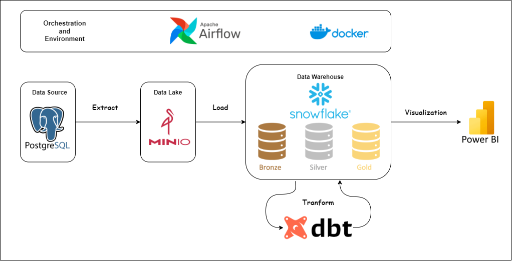

# DVD Rental Pipeline with Docker, Airflow, Snowflake and dbt

A modern data engineering project that implements an end-to-end ETL pipeline for the DVD Rental database using Apache Airflow, MinIO, Snowflake, and dbt.

## Architecture

<p align="center">
  
</p>


## Features

- **Data Extraction**: Daily extraction of DVD rental data from PostgreSQL source
- **Data Lake Storage**: MinIO as the data lake solution for storing raw CSV files
- **Data Warehouse**: Snowflake as the cloud data warehouse
- **Data Transformation**: dbt for handling data transformations with:
  - Bronze layer (raw data)
  - Silver layer (cleaned, standardized data)
  - Gold layer (business-ready data models)
- **Orchestration**: Apache Airflow for pipeline orchestration and scheduling
- **Data Quality**: Automated testing with dbt

## Prerequisites

- Docker and Docker Compose
- Python 3.11+
- PostgreSQL
- Snowflake Account
- MinIO

## Tech Stack

- Apache Airflow 2.9.0
- Apache Spark 3.5.0
- MinIO
- Snowflake
- dbt 1.7.3
- Python 3.11
- PostgreSQL

## Project Structure

```shell
dvd-rental-pipeline/
├── dags/ 
│ └── etl_pipeline.py # Main ETL pipeline DAG
├── scripts/ 
│ ├── extract_data.py # Extract data from PostgreSQL
│ ├── load_to_data_lake.py # Upload data to MinIO
│ ├── load_to_dwh.py # Load data to Snowflake (VM version)
│ ├── load_dwh_snowflake.py # Load data to Snowflake (Local version)
│ ├── etl_data_scd.py # SCD Type 2 implementation
│ └── validation.py # Input validation utilities
├── dbt_snowflake/
│ ├── models/ #
│ │ ├── bronze/ # Raw data models
│ │ ├── silver/ # Cleaned data models
│ │ └── gold/ # Business-ready models
├── init-scripts/ # Initialization scripts
│ └── restore-dvdrental.sh # Database restore script
├── data
├── docker-compose.yml 
├── Dockerfile 
└── requirements.txt
```
## Setup

1. Clone the repository:

```
git clone https://github.com/nits302/DVD_Rental_Pipeline.git
cd dvd-rental-pipeline

```

2. Create and configure environment variables:

```bash
cp .env.example .env
# Edit .env with your configurations
```

3. Build and start the Docker containers:

```bash
docker-compose up -d
```

4. Initialize the database:

```bash
./init-scripts/restore-dvdrental.sh
```

5. Configure dbt:

```bash
cd dbt_snowflake
dbt deps
dbt seed
```

## Pipeline Workflow

The ETL pipeline consists of the following steps:

1. Extract data from PostgreSQL source
2. Load data to MinIO data lake
3. Load data from MinIO to Snowflake
4. Transform data using dbt models
5. Run data quality tests

## Running the Pipeline

The pipeline can be triggered manually through Airflow UI or will run automatically based on the schedule:

1. Access Airflow UI at `http://localhost:8080`
2. Login with default credentials
3. Locate the `etl_pipeline` DAG
4. Trigger the pipeline manually or wait for scheduled run

## Development

1. Create a virtual environment:

```bash
python -m venv venv
source venv/bin/activate  # Linux/Mac
# or
.\venv\Scripts\activate  # Windows
```

2. Install dependencies:

```bash
pip install -r requirements.txt
```

## Contributing

1. Fork the repository
2. Create your feature branch
3. Commit your changes
4. Push to the branch
5. Create a new Pull Request

## License

This project is licensed under the MIT License - see the LICENSE file for details.

## Environment Variables

Required environment variables in `.env` file:

```bash
# PostgreSQL Configuration
POSTGRES_USER=airflow
POSTGRES_PASSWORD=airflow
POSTGRES_DB=dvd_rental
POSTGRES_PORT=5432

# MinIO Configuration
MINIO_ENDPOINT=minio:9000
MINIO_ACCESS_KEY=minioadmin
MINIO_SECRET_KEY=minioadmin
MINIO_BUCKET_NAME=dvdrental

# Snowflake Configuration
SNOWFLAKE_USER=your_username
SNOWFLAKE_PASSWORD=your_password
SNOWFLAKE_ACCOUNT=your_account_id
SNOWFLAKE_DATABASE=DVD_RENTAL
SNOWFLAKE_SCHEMA=PUBLIC
SNOWFLAKE_WAREHOUSE=DVD_RENTAL_DWH
```

## Data Model

The project implements a three-layer data architecture:

### Bronze Layer (Raw)

- Raw data ingested directly from PostgreSQL
- Minimal transformations
- Preserved historical data

### Silver Layer (Standardized)

- Cleaned and standardized data
- Type casting and null handling
- SCD Type 2 for historical tracking
- Incremental loading support

### Gold Layer (Business)

Key dimension and fact tables:

- dim_customer
- dim_film
- dim_store
- dim_staff
- dim_date
- fact_rental

## Testing

The project includes automated tests using dbt:

```bash
# Run all tests
cd dbt_snowflake
dbt test

# Run specific test
dbt test --select dim_customer
```

## Monitoring

- Airflow provides DAG monitoring and alerting
- dbt tests validate data quality
- Logs are available in the `logs/` directory

## Common Issues & Troubleshooting

1. **MinIO Connection Issues**

   - Verify MinIO is running: `docker ps`
   - Check credentials in `.env`
   - Ensure bucket exists

2. **Snowflake Loading Errors**

   - Verify warehouse is running
   - Check user permissions
   - Validate table schemas

3. **dbt Failures**
   - Run `dbt debug` to check connection
   - Verify profile configuration
   - Check model dependencies

## Performance Optimization

- Incremental loading implemented for large tables
- Parallel task execution in Airflow
- Optimized Snowflake warehouse sizing
- Efficient dbt model materialization strategies

## Additional Resources

- [Apache Airflow Documentation](https://airflow.apache.org/docs/)
- [dbt Documentation](https://docs.getdbt.com/)
- [Snowflake Documentation](https://docs.snowflake.com/)
- [MinIO Documentation](https://docs.min.io/)
